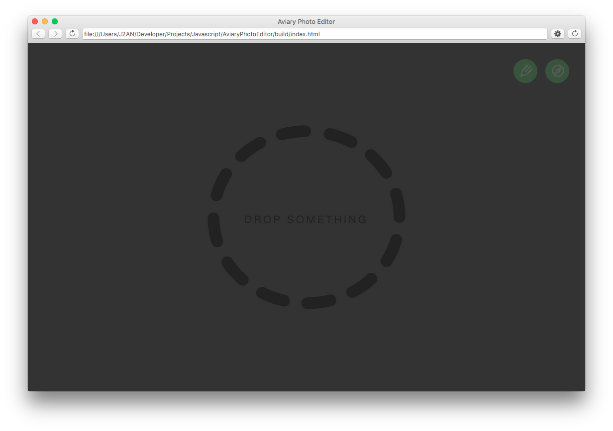
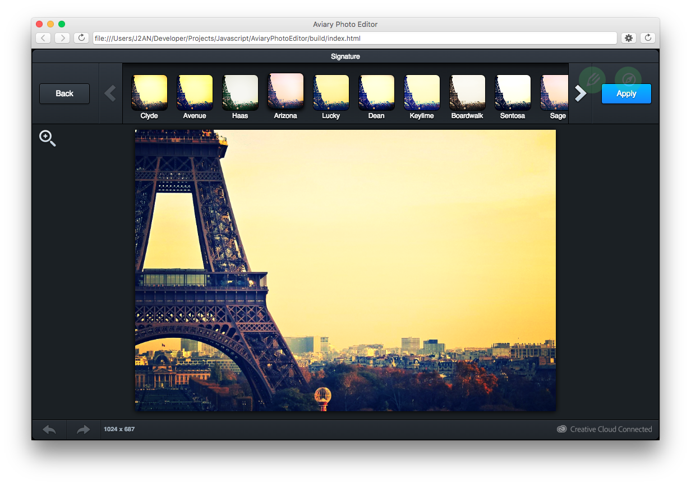
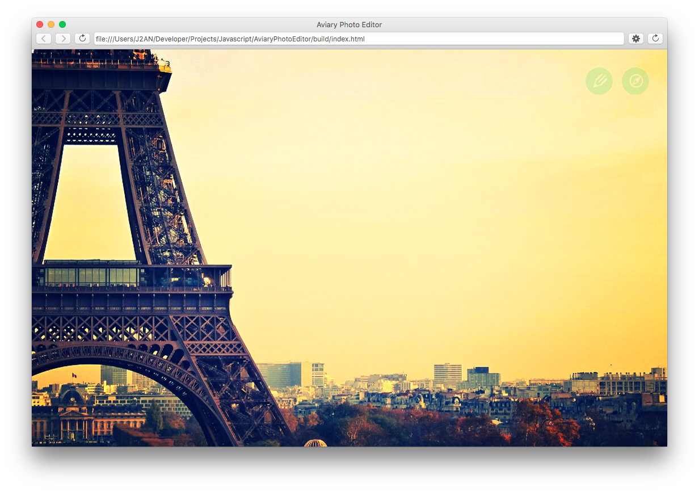

[EDIT]: This an old project of mine which is not obsolete but not that modern. Here is the [Trello board](https://trello.com/b/d2Ed5p8c/aviary-photo-editor). Unfortunately I never had time to implement all tasks labeled as MUST. The most missing part is a true beautiful circular menu instead of those temporary green buttons. The most essential functionalities are there nonetheless.

# Aviary Photo Editor

## Overview

This a basic demo of the node-webkit engine and the Aviary SDK written with Backbone and Mokuai.

**This demo requires node-webkit >= v0.11.5.**

## Goals

The goal of the project was to learn some cool technologies. 

First, I wanted to test the new kid : node-webkit. I love the ground concept. 
I thought it would be a good way to discover node while continuing to learn HTML5.
When I was active on this project, electron was unknown to me. I'm not even sure it was public.

In the HTML5 area, I wanted to experiment with:
* SVG animations
* CSS animations
* a tutorial library like Chardin or Tourist
* CSS filters like blur, desaturate, etc.
* Jade templates
* A better gruntfile organization with load-grunt-config

In the node area, I wanted to experiment with:
* fs operations
* Q promises

This project allowed me also to try the awesome Mokuai plugin which makes code and require boilerplate a breeze. 

## Screen captures

## Screencast

